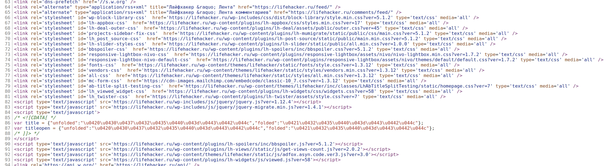
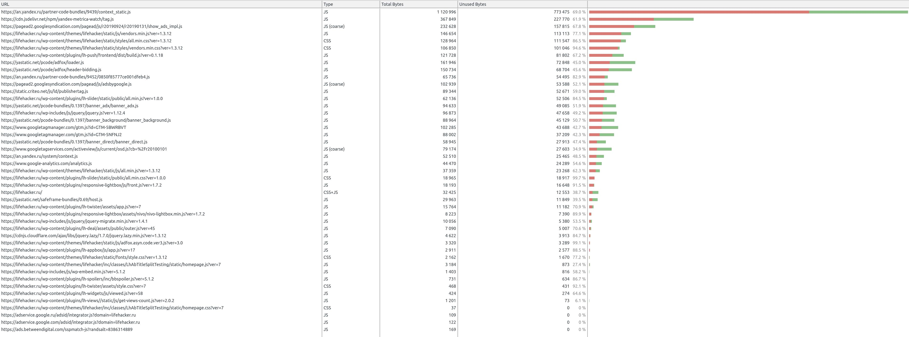

# lifehacker-analyze

## Проблемные ресурсы
Из вкладки network видно большое количество обращений к различным ресурсам, 
связанным с рекламой и аналитикой. 
При этом, часть из этих ресурсов подгружается по нескольку раз:
* yastatic.net/pcode/adfox/adfox-adx-stub.js - 3 раза
* pagead2.googlesyndication.com/pagead/js/adsbygoogle.js - 3 раза
* adservice.google.ru/adsid/integrator.js?domain=lifehacker.ru - 3 раза
* adservice.google.com/adsid/integrator.js?domain=lifehacker.ru - 3 раза
* www.googletagservices.com/activeview/js/current/osd.js?cb=%2Fr20100101 - 3 раза
* pagead2.googlesyndication.com/pagead/js/r20190924/r20190131/show_ads_impl.js - 5 раз

Также подключается два различных Google Tag Manager 
(https://www.googletagmanager.com/gtm.js?id=GTM-5NFNJ2, https://www.googletagmanager.com/gtm.js?id=GTM-5BWRBVT),
что может быть обусловленно бизнес соображениями компании, но на мой взгляд, также можно считать не очень хорошей практикой.

Стоит отметить, что большая часть обращений приходится не на обращения к ресурсам сайта:
из 259 ресурсов только 45 на домене lifehacker.ru, еще 4 на cdn.lifehacker.ru.

Посмотрев на html-код страницы, можно увидеть большое число ресурсов, подключаемых в body синхронно, 
что блокирует отображение страницы до их загрузки:

#### Их список отдельно:
**CSS**
* https://fonts.googleapis.com/css?family=Roboto+Condensed:400,700|Roboto:300,300i,400,400i,500,500i,700,900&amp;subset=cyrillic
* https://maxcdn.bootstrapcdn.com/font-awesome/4.7.0/css/font-awesome.min.css
* https://lifehacker.ru/wp-includes/css/dist/block-library/style.min.css?ver=5.1.2
* https://lifehacker.ru/wp-content/plugins/lh-appbox/css/styles.min.css?ver=17
* https://lifehacker.ru/wp-content/plugins/lh-deal/assets/public/outer.css?ver=45
* https://lifehacker.ru/wp-content/plugins/lh-mumigrate/static/public/css/main.css?ver=5.1.2
* https://lifehacker.ru/wp-content/plugins/lh-post-source/static/public/main.min.css?ver=5.1.2
* https://lifehacker.ru/wp-content/plugins/lh-slider/static/public/all.min.css?ver=1.0.0
* https://lifehacker.ru/wp-content/plugins/lh-spoilers/inc/bbspoiler.css?ver=5.1.2
* https://lifehacker.ru/wp-content/plugins/responsive-lightbox/assets/nivo/nivo-lightbox.min.css?ver=1.7.2
* https://lifehacker.ru/wp-content/plugins/responsive-lightbox/assets/nivo/themes/default/default.css?ver=1.7.2
* https://lifehacker.ru/wp-content/themes/lifehacker/static/fonts/style.css?ver=1.3.12
* https://lifehacker.ru/wp-content/themes/lifehacker/static/styles/vendors.min.css?ver=1.3.12
* https://lifehacker.ru/wp-content/themes/lifehacker/static/styles/all.min.css?ver=1.3.12
* https://cdn-images.mailchimp.com/embedcode/classic-10_7.css?ver=1.3.12
* https://lifehacker.ru/wp-content/themes/lifehacker/inc/classes/LhAbTitleSplitTesting/static/homepage.css?ver=7
* https://lifehacker.ru/wp-content/plugins/lh-widgets/css/widgets.css?ver=58
* https://lifehacker.ru/wp-content/plugins/lh-twister/assets/style.css?ver=7
* https://lifehacker.ru/wp-includes/js/jquery/jquery.js?ver=1.12.4
* https://lifehacker.ru/wp-includes/js/jquery/jquery-migrate.min.js?ver=1.4.1

**JS**
* https://lifehacker.ru/wp-content/plugins/lh-spoilers/inc/bbspoiler.js?ver=5.1.2
* https://lifehacker.ru/wp-content/plugins/lh-views//static/js/get-views-count.js?ver=2.0.2
* https://lifehacker.ru/wp-content/themes/lifehacker/static/js/adfox.asyn.code.ver3.js?ver=3.0
* https://lifehacker.ru/wp-content/plugins/lh-widgets/js/viewed.js?ver=58
* https://yastatic.net/pcode/adfox/loader.js

Так как сайт не использует http/2, при котором разделение на различные файлы оправдано, возможно следует объединять эти ресурсы в один bundle, 
а также минифицировать их.

Также не совсем ясно использование fontawesome. 
Судя повсему, подключенный [font-awesome.min.css](https://maxcdn.bootstrapcdn.com/font-awesome/4.7.0/css/font-awesome.min.css) 
ни разу не используется на странице. Браузер даже не подгружает шрифт, указанный в этом css.

### Perfomance

| Событие | Время
| --- | --- |
| First Paint | 550ms |
| First Contentful Paint | 550ms
| First Meaningful Paint | 1533ms
| DOMContentLoaded Event | 1683ms
| Largest Contentful Paint | 2666ms
| Onload Event | 3344ms 

| Что делал | Время, ms
| --- | --- |
| Loading | 49
| Scripting | 1926 
| Rendering | 656
| Painting | 117
| System | 352 
 

### Coverage

**Неиспользованные ресурсы:**
* CSS 233kb
* JS 2.1mb

